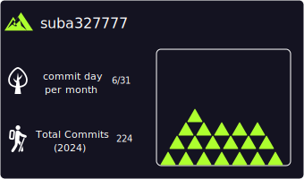

  <samp>
    
  # Hi there  I'm Suba
  
  </samp>

  
<!--    -->
  
  

  <!-- Articles のバッジ -->
  
  <!-- Books のバッジ -->
  
  <!-- Scraps のバッジ -->
  

  <samp>
    
  ## 💎 GitHub Stats
  </samp>

 
  
  
   
  
  
   
  
<!--   
  
   -->

<!--       -->

